# Traveler

## Summary
Traveler is an web-app that allows people to browse different hotels
and restaurants in different cities they wish to travel to.

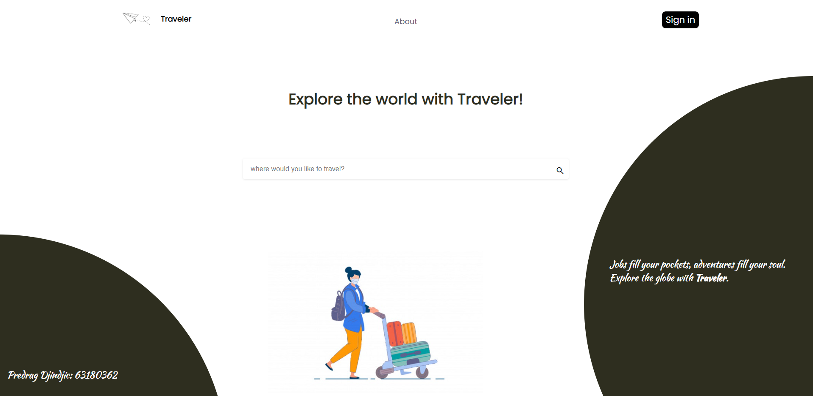

## Search
When you enter the first page, you are greeted by a search bar that allows you to type in a city you wish to travel to.

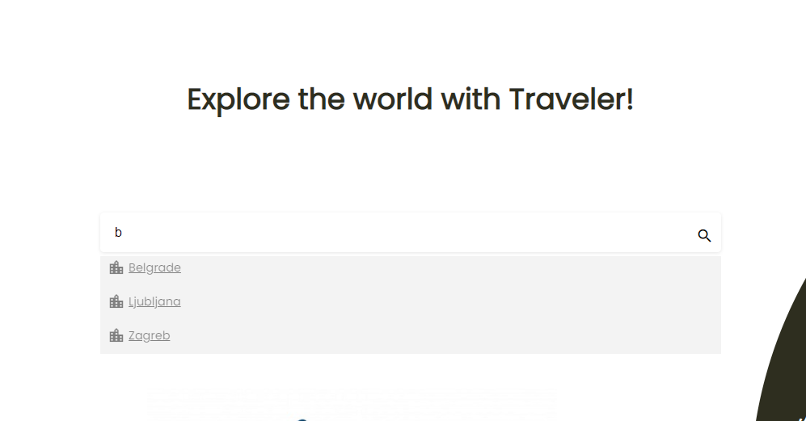

## Cities
When you select the city, you enter the city page with some pictures, brief description and a geolocation. You have two choices, to browse top hotels, or to browse top restaurants in the city. All of the data is stored in a database for each city.

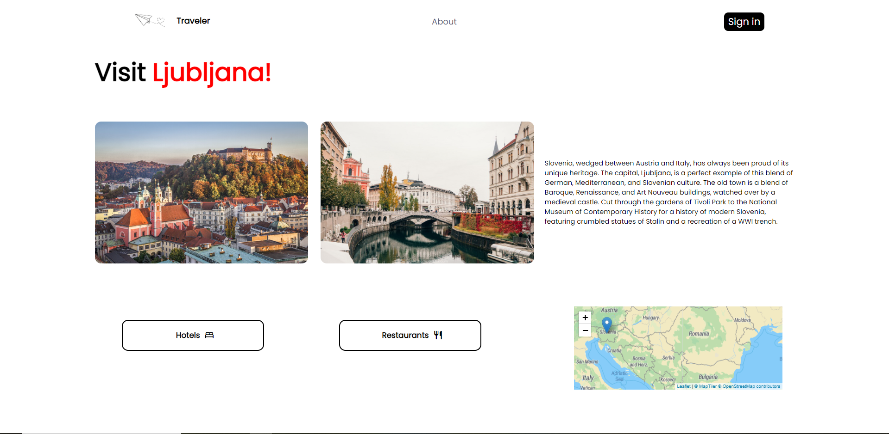

## Hotels
If you select hotels, you can see the list of hotels with some details.

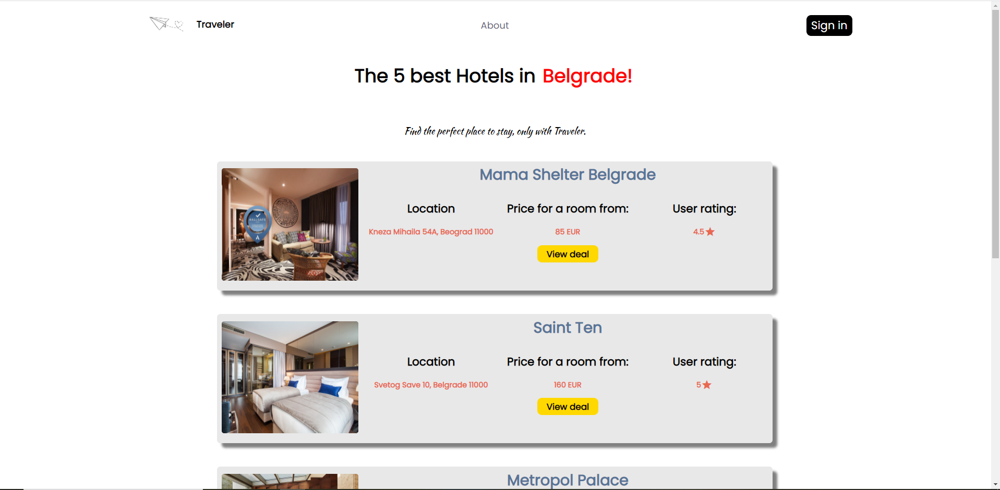

And if you select any of them, you can see the hotel page with some description, price, location, picture slider and reviews. You can also book rooms if you are logged in. If you are not logged in, you can't review a hotel.

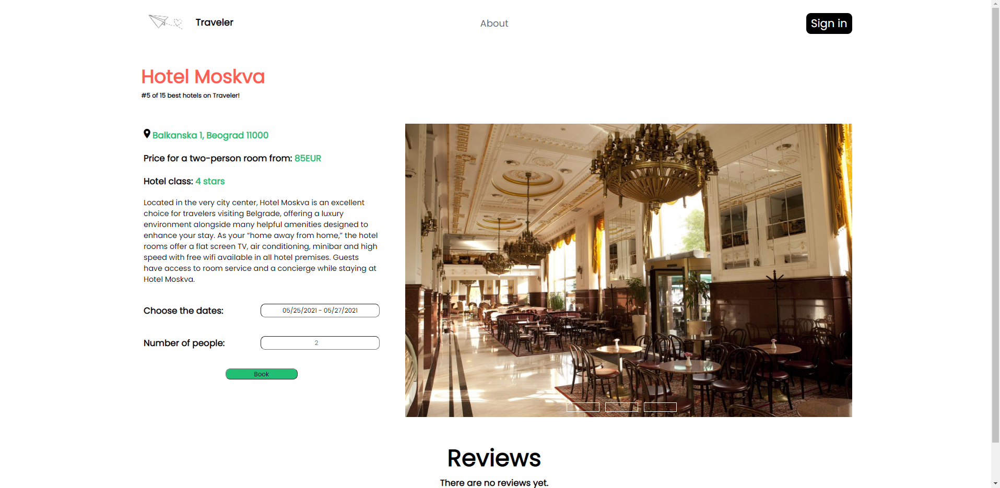

## Restaurants
If you select restaurants, you can see the list of restaurants with some details.

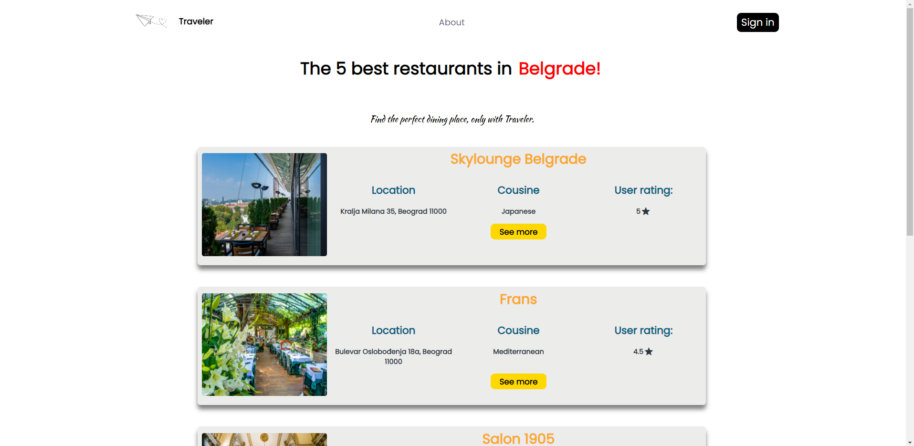

And if you select any of them, you can see the restaurant page with some description, cousine, location, website, pictures and reviews. If you are not logged in, you can't review a hotel.

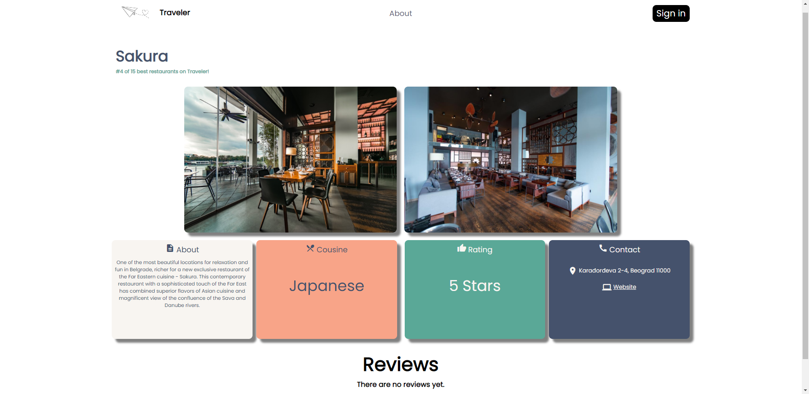

## Loggin in
If you want to log in, you acces log-in page where you can register as a new user or log in if you already have an account.

When you log in, you get a logout button and a link you account page.

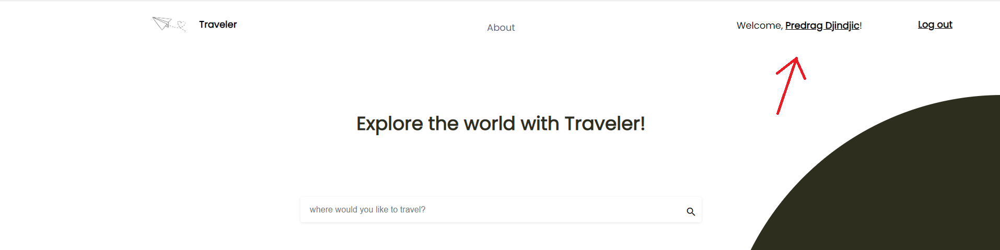

### Reviews
After you log in, you can review each of the objects you view and rate them.

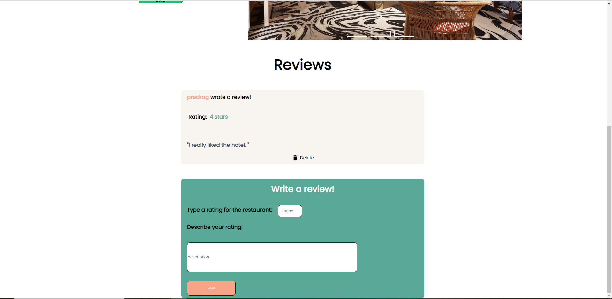

### Bookings
You can also book rooms of hotels and all your bookings can be found at your profile page.

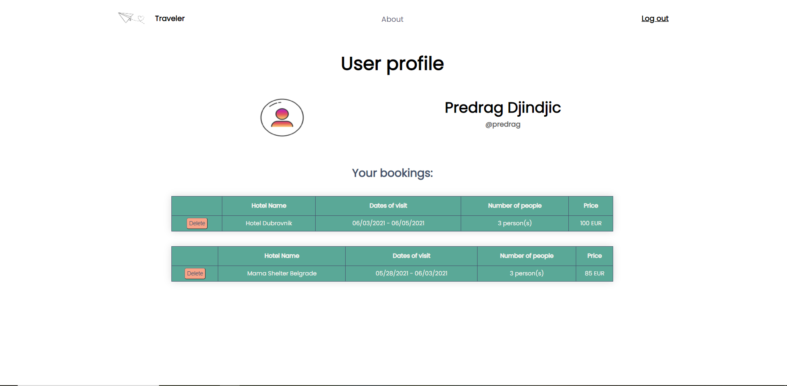

## About
I also added an about page, where you can find more info about this project.

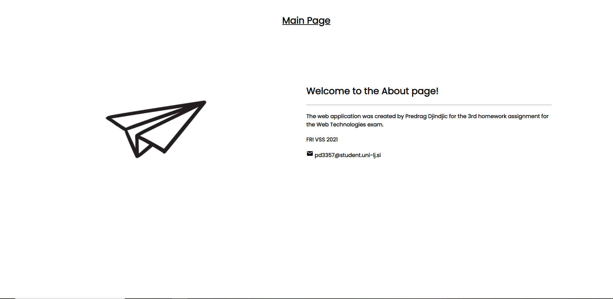

## Technologies
Technologies used for this project were:

- HTML
- CSS
- JavaScript
- PHP
- MySQL
- Vue.js
- jQuery
- Leaflet library

